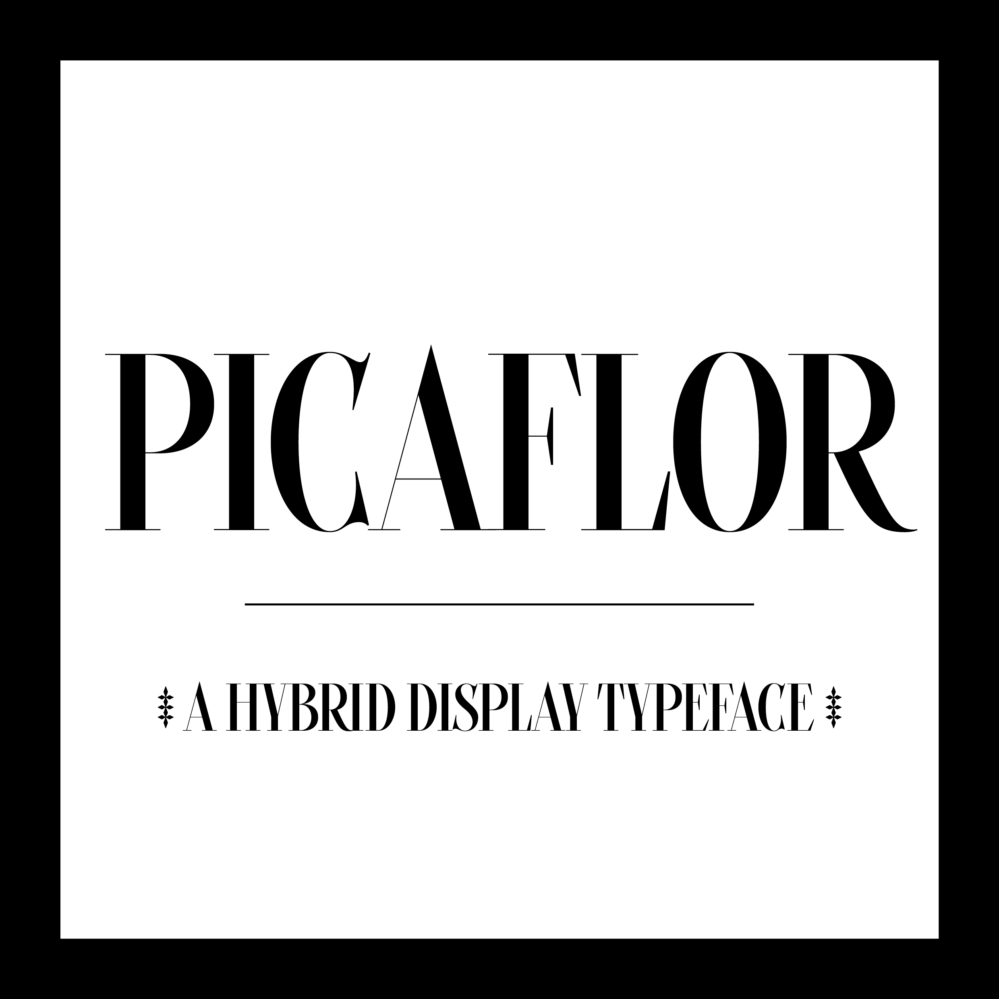
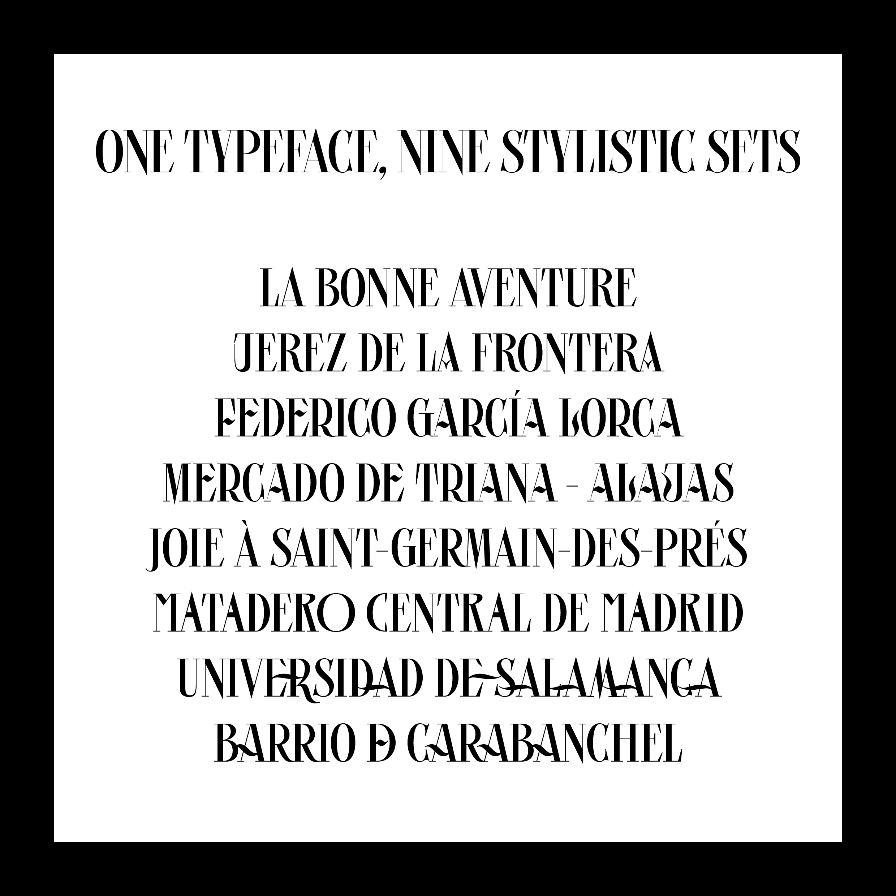
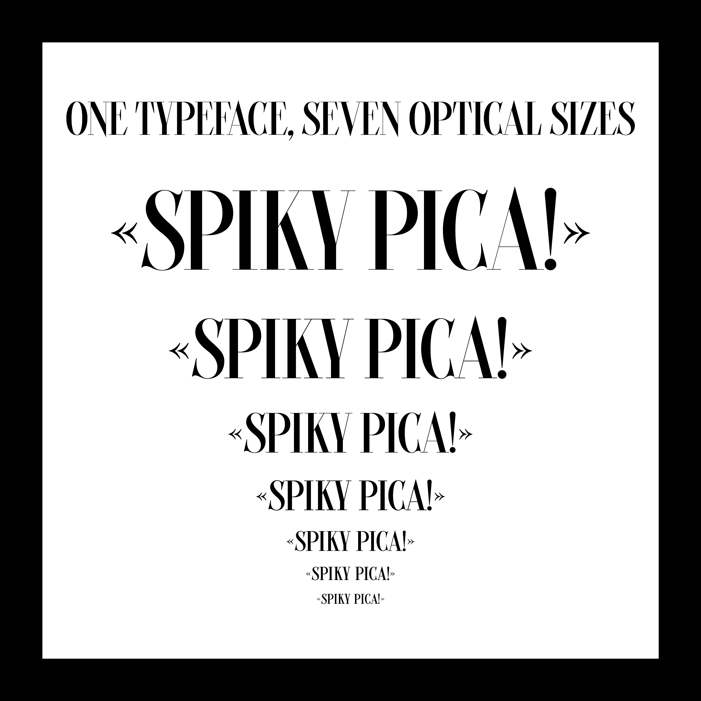

# Picaflor

<strong>[EN]</strong>

Picaflor is a hybrid display typeface with calligraphic details - French didone meet Spanish vernacular exhuberance.

Picaflor has been created by Ariel Martín Pérez (www.arielgraphisme.com - contact@arielgraphisme.com) and released under the SIL Open Font Licence 1.1 in 2021. Picaflor is distributed by the Tunera Type Foundry (www.tunera.xyz).

To know how to use this typeface, please read the FAQ (http://www.tunera.xyz/faq/) 

<strong>[FR]</strong>

Picaflor est un caractère de titrage hybride avec des détails calligraphiques, où la rigueur des didones françaises rencontre l'exubérance vernaculaire espagnole. 

Picaflor a été créé par Ariel Martín Pérez (www.arielgraphisme.com - contact@arielgraphisme.com) et publié sous la licence SIL Open Font License 1.1 en 2021. Picaflor est distribué par Tunera Type Foundry (www.tunera.xyz).

Pour savoir comment utiliser cette fonte, veuillez lire la FAQ (http://www.tunera.xyz/faq-2/)

<strong>[ES]</strong>

Picaflor es un tipo de letra decorativo híbrido con detalles caligráficos, una especie de didona francesa enamorada de la exuberancia vernacular española.

Picaflor ha sido creado por Ariel Martín Pérez (www.arielgraphisme.com - contact@arielgraphisme.com) y publicado bajo la licencia SIL Open Font License 1.1 en 2021. Picaflor es distribuido por Tunera Type Foundry (www.tunera.xyz).

Para saber cómo usar este tipo de letra, lea las preguntas frecuentes (http://www.tunera.xyz/preguntas-frecuentes/)

## Specimen

## License

Picaflor is licensed under the SIL Open Font License, Version 1.1.
This license is copied below, and is also available with a FAQ at
http://scripts.sil.org/OFL

## Repository Layout

This font repository follows the Unified Font Repository v2.0,
a standard way to organize font project source files. Learn more at
https://github.com/unified-font-repository/Unified-Font-Repository
